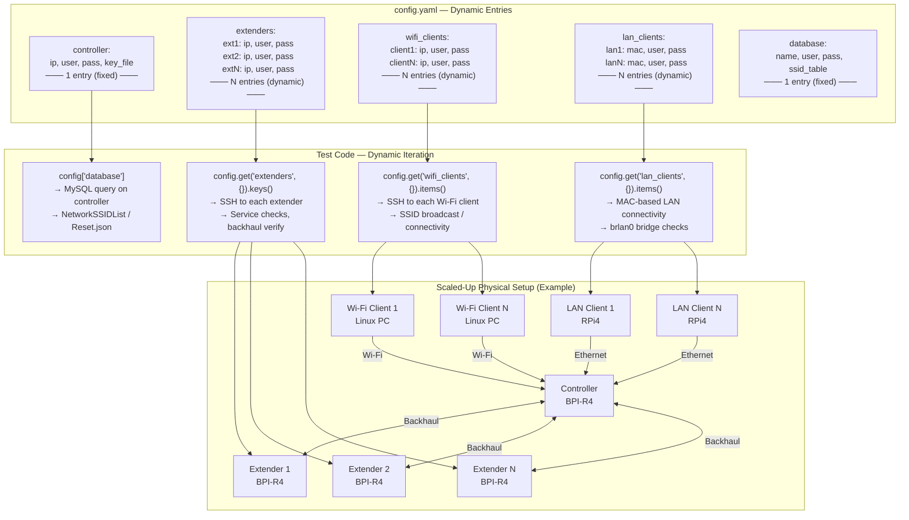

# Unified WiFiMesh Sanity Tests

## User Manual and Setup Guide

**Version:** 1.2  
**Date:** May 2026  
**Purpose:** Sanity test suite for EasyMesh mesh networking systems

## Table of Contents

1. Overview
2. Setup Dependencies
3. Installation Guide
4. Configuration
5. Test Cases Documentation
6. Running the Test Suite
7. Expected Outputs
8. Troubleshooting
9. Best Practices
10. Support and Documentation

## Overview

This test suite provides automated sanity testing for EasyMesh R6 Pro Controller and related mesh networking functionality.

The suite validates:

- Service status and core functionality
- Database configuration and synchronization
- WiFi connectivity and SSID broadcasting
- Network topology verification
- LAN and WiFi client connectivity
- Web UI (RDKB CLI) functionality

### Test Environment

| Component | Details |
| --- | --- |
| Framework | pytest with Playwright for UI testing |
| Browser Automation | Chromium/Edge/Chrome via Playwright |
| Connection Protocol | SSH (via Paramiko) for device communication |

## Setup Dependencies

### System Requirements

- OS: Windows / Linux / macOS
- Python Version: 3.8 or higher
- Network: Access to controller, agent, and client devices via SSH
- Browsers: Chrome/Chromium/Edge pre-installed (Playwright downloads drivers automatically)

### Hardware/Network Requirements

- Controller Device: 1 device accessible via network (configured in config.yaml)
- Agent/Extender Devices: 2 devices accessible via network (configured in config.yaml)
- WiFi Client: 1 device with WiFi capability (configured in config.yaml). This Wi-Fi client should be connected to the same LAN network as the BPI controller.
- LAN Client: 1 device connected to controller via Ethernet (configured in config.yaml)
- Database Access: Mesh database accessible from controller (configured in config.yaml)

### Test suite Execution Pre-requisites

- The sanity test suite execution requires test setup with minimum - 1 Controller, 2 Extenders, 1 LAN client and 1 Wi-Fi client. More extenders and clients can be configured in config.yaml.
- Mesh backhaul formation must be ensured before running the test suite. If backhaul is not successfully formed, test cases are expected to fail.
- Please configure the test setup details as directed in the Configuration section of this document. Minimum 1 extender must be configured in config.yaml under extenders.
- Minimum of 2 extenders need to be onboarded successfully for running the topology related test test_network_topology.py::test_validate_ui_topology.
- Please ensure that the setup is in default state before triggering the full suite. Only with default state, the test cases test_basic_sanity_tc::test_db_values_match_default_json and test_basic_sanity_tc::test_broadcast_default_SSID will pass.

### Known failures encountered with the test suite execution

| Sl.No | Failed test case name | Description | Bug ID |
| --- | --- | --- | --- |
| 1 | test_em_functionality.py::test_rdkbcli_wifi_reset_with_default_values | onewifi_em_ctrl process crash on WiFi Reset from RDKB-CLI | https://jira.rdkcentral.com/jira/browse/RDKBWIFI-373 |
| 2 | test_em_functionality.py::test_rdkbcli_wifi_reset_with_custom_values | WiFi Reset with Custom Values Not Working via rdkbcli | https://jira.rdkcentral.com/jira/browse/RDKBWIFI-418 |
| 3 | test_em_functionality.py::test_rdkbcli_channel_change_preference | Intermittent Operating Class changes during Channel Switching via RDKBCLI | https://jira.rdkcentral.com/jira/browse/RDKBWIFI-424 |

### Test suite Execution Pre-requisites 

- The sanity test suite execution requires test setup with 1 Controller, 2 Extenders, 1 LAN client and 1 Wi-Fi client.
- Mesh backhaul formation must be ensured before running the test suite. If backhaul is not successfully formed, test cases are expected to fail.
- Please configure the test setup details as directed in 'Configuration' section of this document. Only 1 Extender details need to be configured as part of 'Agent details' in conftest.py.
- 2 extenders need to be onboarded successfully for running the topology related test 'test_network_topology.py::test_validate_ui_topology'.
- Please ensure that the setup is in default state or should be set to a default state before triggering the full suite. Only with default state, the 2 test cases 'test_basic_sanity_tc::test_db_values_match_default_json' and 'test_basic_sanity_tc::test_broadcast_default_SSID' will pass.

### Port Requirements

- SSH: Port 22 (controller, agent, clients)
- HTTP: Port 8888 (RDKB CLI Web Interface)

## Test Setup Architecture

### Physical Test Setup

The minimum test setup consists of 1 Controller (BPI-R4), 2 Extenders (BPI-R4), 1 Wi-Fi Client (Linux PC), and 1 LAN Client (Raspberry Pi 4).


**Key Features:**
- The test machine reaches all devices over SSH (:22) and the RDKB-CLI web UI over HTTP (:8888)
- Both extenders form the EasyMesh backhaul with the controller
- LAN Client (RPi4) connects via Ethernet into the `brlan0` bridge on the controller
- Wi-Fi Client (Linux PC) connects over the Mesh SSID for connectivity validation

### Scalability via config.yaml

The test suite supports dynamic scaling. Add new extenders, Wi-Fi clients, and LAN clients by defining new entries in `config.yaml`. The test code automatically iterates over all configured devices—no code changes required.



**How Scalability Works:**

| config.yaml Section | Code Pattern | What Scales |
|---|---|---|
| `extenders: extN: ...` | `config.get("extenders", {}).keys()` | Service checks, backhaul verification on all extenders |
| `wifi_clients: clientN: ...` | `config.get("wifi_clients", {}).items()` | SSID broadcast and Wi-Fi connectivity tests per client |
| `lan_clients: lanN: ...` | `config.get("lan_clients", {}).items()` | LAN connectivity tests per client |
| `controller` | Single fixed entry | Always 1 controller |

To scale, simply add new named entries to `config.yaml` under `extenders`, `wifi_clients`, or `lan_clients`—the test suite dynamically discovers and tests each device.

## Installation Guide

### Step 1: Install Python Dependencies

Install all required Python packages using pip:

```bash
pip install pytest==7.4.0
pip install pytest-html==3.2.0
pip install playwright==1.40.0
pip install paramiko==3.3.1
pip install pyyaml==6.0.1
pip install scp==0.15.0
pip install scikit-image==0.21.0
pip install opencv-python==4.8.1.78
```

### Step 2: Install Playwright Browsers

Playwright requires browser drivers to be installed:

```bash
playwright install chromium
# OR for other browsers:
playwright install chrome
playwright install msedge
```

### Alternative: Install from Requirements File

Create a requirements.txt file with the above packages and run:

```bash
pip install -r requirements.txt
playwright install chromium
```

### Package Details

| Package | Version | Purpose |
| --- | --- | --- |
| pytest | 7.4.0 | Test framework and execution engine |
| pytest-html | 3.2.0 | HTML report generation |
| playwright | 1.40.0 | Browser automation for UI testing |
| paramiko | 3.3.1 | SSH client for device communication |
| pyyaml | 6.0.1 | YAML config loading/parsing |
| scp | 0.15.0 | SSH file transfer for log collection |
| scikit-image | 0.21.0 | Image similarity comparison for topology |
| opencv-python | 4.8.1.78 | Image processing for topology validation |

## Configuration

### Updating Testbed Details in config.yaml

All runtime configuration is loaded from UI_Automation/config.yaml via the config fixture in conftest.py.

Update UI_Automation/config.yaml with your setup details:

```yaml
controller:
  ip: "<controller_ip>"
  user: "<controller_username>"
  pass: None
  key_file: null

extenders:
  ext1:
    ip: "<agent1_ip>"
    user: "<agent1_username>"
    pass: None
    passphrase: None
  ext2:
    ip: "<agent2_ip>"
    user: "<agent2_username>"
    pass: None
    passphrase: None

wifi_clients:
  client1:
    ip: "<wifi_client_ip>"
    user: "<wifi_client_username>"
    pass: "<wifi_client_password>"

lan_clients:
  lan1:
    mac: "<lan_client_mac>"
    user: "<lan_client_username>"
    pass: "<lan_client_password>"

database:
  name: OneWifiMesh
  user: "<database_username>"
  pass: "<database_password>"
  ssid_table: NetworkSSIDList

system:
  bridge_intf: brlan0
  wifi_reset_interface: eth0_virt_peer
  reset_json_file: /usr/ccsp/EasyMesh/Reset.json
```

### Supported Keys and Validation Notes

- controller.ip and controller.user are validated as required.
- extenders must be a YAML mapping. Each extender requires ip and user; pass is required for SSH login.
- Configure wifi_clients and lan_clients when running Wi-Fi and LAN client tests.
- lan_clients.<name>.mac is required for LAN connectivity validation.
- database.name, database.user, database.pass, and database.ssid_table are used by DB queries.
- system.bridge_intf, system.wifi_reset_interface, and system.reset_json_file are used by topology and Wi-Fi reset flows.

### Device Scaling

- Add more extenders under extenders and more clients under wifi_clients/lan_clients in the YAML file as needed.
- Tests auto-discover configured extenders in YAML file and iterate dynamically over them.

## Test Cases Documentation

### 1. test_basic_sanity_tc.py

**Purpose:** Validate core service functionality, configurations, and basic connectivity.

| # | Test Name | Summary |
| --- | --- | --- |
| 1 | test_onewifi_service_status | Verify OneWiFi service is active on both controller and agent devices |
| 2 | test_verify_core_files_presence | Check for core dump files to detect service crashes |
| 3 | test_ieee1905_em_ctrl_service_status | Verify IEEE1905 EM Control service status on controller |
| 4 | test_em_ctrl_service_status | Verify EM Control service status on controller |
| 5 | test_ieee1905_em_agent_service_status | Verify IEEE1905 EM Agent service status on agent device |
| 6 | test_em_agent_service_status | Verify EM Agent service status on agent device |
| 7 | test_db_values_match_default_json | Validate database SSID entries match Reset.json default configuration |
| 8 | test_log_files_presence | Verify presence of EM and IEEE1905 log files on devices (parametrized) |
| 9 | test_all_configured_vaps_are_up | Ensure all configured Virtual Access Points are operational |
| 10 | test_broadcast_default_SSID | Verify default fronthaul and backhaul SSIDs are being broadcast |

### 2. test_em_functionality.py

**Purpose:** Test EasyMesh functionality including SSID/password updates, channel changes, and WiFi reset.

| # | Test Name | Summary |
| --- | --- | --- |
| 1 | test_rdkbcli_update_verify_ssid | Update fronthaul SSID from RDKB CLI and verify on controller and agent |
| 2 | test_rdkbcli_update_verify_password | Update fronthaul password from RDKB CLI and verify in UI and DB |
| 3 | test_rdkbcli_verify_channel_change | Channel change test is currently skipped due to unstable dropdown and operating class values |
| 4 | test_rdkbcli_wifi_reset_with_default_values | Perform WiFi reset and verify revert to default SSID/password |
| 5 | test_rdkbcli_wifi_reset_with_custom_values | Perform WiFi reset with custom SSID/password values |

### 3. test_network_topology.py

**Purpose:** Validate network topology structure and UI representation.

| # | Test Name | Summary |
| --- | --- | --- |
| 1 | test_validate_ui_topology | Verify UI topology graph matches backend TR-181 data, validate SSID and BSSID mapping |
| 2 | test_determine_topology_type_from_brctl_command | Determine if mesh topology is Star or Daisy-chain based on backhaul |

### 4. test_wifi_client_connectivity.py

**Purpose:** Test WiFi client connectivity to the mesh network.

| # | Test Name | Summary |
| --- | --- | --- |
| 1 | test_fronthaul_wifi_client_connectivity | Verify WiFi client can connect to fronthaul SSID, obtain IP, and access internet |
| 2 | test_fronthaul_wifi_client_connectivity_with_updated_ssid | Verify client connectivity after SSID update via RDKB CLI |

### 5. test_lan_client_connectivity.py

**Purpose:** Test LAN client connectivity and network access.

| # | Test Name | Summary |
| --- | --- | --- |
| 1 | test_lan_client_connectivity | Verify LAN client obtains IP and validates internet connectivity |

## Running the Test Suite

### Method 1: Using main.py (Recommended)

The main.py file provides a convenient way to execute tests with predefined configurations.

#### Basic Execution

```bash
python main.py
```

Note: Ensure config.yaml is updated with your device credentials before running.

#### Run All Tests (Recommended with synchronized output directory)

```powershell
$run = "TestRun_$(Get-Date -Format yyyyMMdd_HHmmss)"
$env:TEST_RUN_DIR = $run
pytest -v --html="$run/Reports/sanity_report.html" --self-contained-html
```

#### Run All Tests (Simple)

```bash
pytest -v --html=Reports/sanity_report.html --self-contained-html
```

#### Run Specific Test File

```bash
pytest test_basic_sanity_tc.py -v --html=Reports/sanity_report.html --self-contained-html
```

#### Run Specific Test Case

```bash
pytest test_basic_sanity_tc.py::test_onewifi_service_status -v
```

#### Run Tests Matching a Pattern

```bash
pytest -k "ssid" -v --html=Reports/sanity_report.html --self-contained-html
```

#### Run Tests in Parallel

```bash
# Install first:
pip install pytest-xdist

pytest -v -n 4 --html=Reports/sanity_report.html --self-contained-html
```

## Expected Outputs

### Console Output

The test suite produces color-coded console output:

```text
============================= test session starts =============================
platform win32 -- Python 3.11.x, pytest-7.4.0, py-1.x.x, pluggy-1.x.x
rootdir: /path/to/tests
collected 28 items

test_basic_sanity_tc.py::test_onewifi_service_status PASSED                   [ 4%]
test_basic_sanity_tc.py::test_verify_core_files_presence PASSED               [ 8%]
...
test_em_functionality.py::test_rdkbcli_wifi_reset_with_custom_values PASSED   [100%]

============================== 28 passed in 245.32s ==============================
```

### Log Message Format

**SUCCESS Messages (Green):**

```text
PASS: Service is running as expected on controller device
PASS: Client connected to fronthaul network successfully via BSSID xx:xx:xx:xx:xx:xx
```

**FAILURE Messages (Red):**

```text
FAIL: Service is NOT running on controller: inactive (dead)
FAIL: No fronthaul AP BSSIDs are visible on client for SSID test-ssid
```

### HTML Report

A comprehensive HTML report is generated at the path passed to --html.

#### Report Contents

- Test Summary: Pass/Fail/Skip statistics
- Execution Timeline: Duration for each test
- Detailed Logs: Console output for each test
- Screenshots: UI screenshots for failed tests
- Error Messages: Full error traceback

#### Report Features

- Color-coded test results (Green=Pass, Red=Fail, Orange=Skip)
- Sortable test results table
- Expandable log details
- Embedded screenshots for debugging

### Generated Files

```text
UI_Automation/
	TestRun_YYYYMMDD_HHMMSS/
		Screenshots/
			rdkbcli_updated_ssid.png
			rdkbcli_wifi_reset_custom_values.png
			network_topology.png
			...
		Reports/
			sanity_report.html
```

Note: Screenshots are stored under TEST_RUN_DIR/Screenshots when TEST_RUN_DIR is set, otherwise under an auto-created TestRun_ timestamp directory.

## Troubleshooting

### Common Issues and Solutions

#### SSH Connection Timeout

**Error:** Timeout while connecting to controller_ip:22

**Solutions:**

1. Verify device IP addresses are correctly configured in config.yaml.
2. Ensure devices are reachable on the network.
3. Check SSH credentials (username/password) are correct.
4. Verify network connectivity and firewall rules allow SSH (port 22).
5. Increase timeout in conftest.py (example: timeout=30 to timeout=60).

#### Browser Launch Failure

**Error:** Chromium/Chrome browser not found

**Solutions:**

1. Reinstall Playwright browsers using playwright install chromium.
2. Install with system dependencies using playwright install --with-deps.

#### Database Query Failures

**Error:** Error executing command: Access denied for user

**Solutions:**

1. Verify database credentials in config.yaml are correct.
2. Check database user permissions and privileges.
3. Verify database service is running on the device.
4. Check database connectivity and network access from controller.

#### Test Timeout

**Error:** Timeout occurred after 30000ms

**Solutions:**

1. Increase default timeout in conftest.py (example: page.set_default_timeout(60000)).
2. Run tests individually to identify slow operations.
3. Check device system load and resources.

#### Playwright Timeout on Page Load

**Error:** Timeout while launching RDKB CLI page

**Solutions:**

1. Verify RDKB CLI web interface is running on the controller.
2. Check network connectivity to the controller device.
3. Increase navigation timeout in conftest.py.
4. Use headless browser mode for faster execution.

## Best Practices

- Run tests sequentially because tests may have device state dependencies.
- Check device state before test execution.
- Review HTML reports for detailed failure analysis.
- Review screenshots for UI validation.
- Archive reports for trend analysis.
- Never hardcode credentials in version control; use environment variables.
- Ensure each test cleans up state to avoid inter-test dependencies.

## Support and Documentation

- Check test output logs in console.
- Review HTML report at the path passed in --html.
- Examine screenshots in Screenshots directory.
- Verify device connectivity with SSH commands.
- Review config.yaml for testbed configuration options.

**Last Updated:** May 2026  
**Version:** 1.2  
**Maintained by:** TDKB Test Automation Team