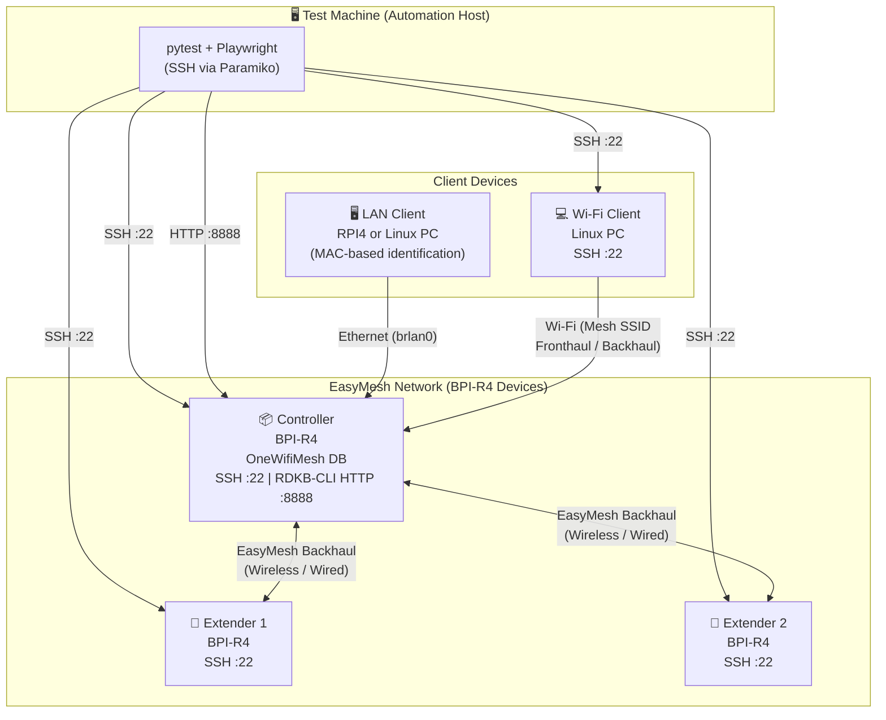
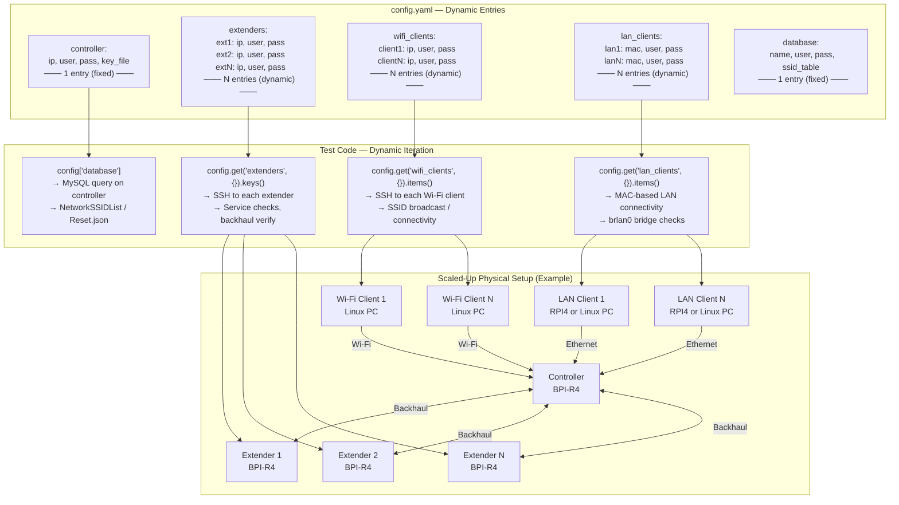

# Unified WiFiMesh Sanity Tests

## User Manual and Setup Guide

**Version:** 1.2  
**Date:** June 2026  
**Purpose:** Sanity test suite for EasyMesh mesh networking systems

## Table of Contents

1. [Overview](#overview)
2. [Test Environment](#test-environment)
3. [System Requirements](#system-requirements)
4. [Hardware/Network Requirements](#hardwarenetwork-requirements)
5. [Test Suite Execution Pre-requisites](#test-suite-execution-pre-requisites)
6. [Steps To Execute The Sanity Test Suite](#steps-to-execute-the-sanity-test-suite)
7. [Known failures encountered with the test suite execution](#known-failures-encountered-with-the-test-suite-execution)
8. [Test suite Limitations](#test-suite-limitations)
9. [Port Requirements](#port-requirements)
10. [Test Setup Architecture](#test-setup-architecture)
  - [Physical Test Setup](#physical-test-setup)
  - [Scalability via config.yaml](#scalability-via-configyaml)
11. [Installation Guide](#installation-guide)
  - [Step 1: Install Python Dependencies](#step-1-install-python-dependencies)
  - [Step 2: Install Playwright Browsers](#step-2-install-playwright-browsers)
  - [Alternative: Install from Requirements File](#alternative-install-from-requirements-file)
  - [Package Details](#package-details)
12. [Configuration](#configuration)
  - [Updating Testbed Details in config.yaml](#updating-testbed-details-in-configyaml)
  - [Supported Keys and Validation Notes](#supported-keys-and-validation-notes)
  - [Device Scaling](#device-scaling)
13. [Running the main.py file](#running-the-mainpy-file)
  - [Basic Execution](#basic-execution)
  - [Run All Tests (Recommended with synchronized output directory)](#run-all-tests-recommended-with-synchronized-output-directory)
  - [Run All Tests (Simple)](#run-all-tests-simple)
  - [Run Specific Test File](#run-specific-test-file)
  - [Run Specific Test Case](#run-specific-test-case)
  - [Run Tests Matching a Pattern](#run-tests-matching-a-pattern)
  - [Run Tests in Parallel](#run-tests-in-parallel)
14. [Expected Outputs](#expected-outputs)
  - [Console Output](#console-output)
  - [Log Message Format](#log-message-format)
  - [HTML Report](#html-report)
    - [Report Contents](#report-contents)
    - [Global Setup Fixture Output](#global-setup-fixture-output)
    - [Report Features](#report-features)
  - [Generated Files](#generated-files)
15. [Troubleshooting](#troubleshooting)
  - [Common Issues and Solutions](#common-issues-and-solutions)
    - [SSH Connection Timeout](#ssh-connection-timeout)
    - [Browser Launch Failure](#browser-launch-failure)
    - [Database Query Failures](#database-query-failures)
    - [Test Timeout](#test-timeout)
    - [Playwright Timeout on Page Load](#playwright-timeout-on-page-load)
16. [Best Practices](#best-practices)
17. [Support and Documentation](#support-and-documentation)

## Overview

This test suite provides automated sanity testing for EasyMesh R6 Pro Controller and related mesh networking functionality.

The suite validates:
- Service status and core functionality
- Database configuration and synchronization
- WiFi connectivity and SSID broadcasting
- Network topology verification
- LAN and WiFi client connectivity
- Web UI (RDKB CLI) functionality

For the detail test case documentation, please refer to the [Sanity_Tests_Documentation.md](Sanity_Tests_Documentation.md) file.

## Test Environment

| Component | Details |
| --- | --- |
| Framework | pytest with Playwright for UI testing |
| Browser Automation | Chromium/Edge/Chrome via Playwright |
| Connection Protocol | SSH (via Paramiko) for device communication |

## System Requirements

- OS: Windows / Linux / macOS
- Python Version: 3.8 or higher
- Network: Access to controller, agent, and client devices via SSH
- Browsers: Chrome/Chromium/Edge pre-installed (Playwright downloads drivers automatically)

## Hardware/Network Requirements

- Controller Device: 1 device accessible via network (configured in config.yaml)
- Agent/Extender Devices: 2 devices accessible via network (configured in config.yaml)
- WiFi Client: 1 device with Linux OS and WiFi capability (configured in config.yaml). This Wi-Fi client should be connected to the same LAN network as the BPI controller and the client user should mandatorily have sudo access.
- LAN Client: 1 device with Linux OS connected to controller via Ethernet (RPI4 or Linux PC supported; configured in config.yaml)
- Database Access: Mesh database accessible from controller (configured in config.yaml)

## Test Suite Execution Pre-requisites

- The sanity test suite execution requires test setup with minimum - 1 Controller, 2 Extenders, 1 LAN client and 1 Wi-Fi client. More extenders and clients can be configured in config.yaml.
- Please ensure that the setup is in default state before triggering the full suite. Only with default state, the setup stage will pass.
- Mesh backhaul formation must be ensured before running the test suite. If backhaul is not successfully formed, setup stage is expected to fail and no tests will be executed.
- Please configure the test setup details as directed in the [Configuration](#configuration) section of this document. Minimum 1 extender must be configured in config.yaml under extenders.
- Minimum of 2 extenders need to be onboarded successfully for running the topology related test test_network_topology.py.

## Steps To Execute The Sanity Test Suite

- Clone the repository
  ```bash
  git clone git@github.com:rdkcentral/easymesh-sanity-testsuite.git
  ```
- Checkout to the latest main branch
  ```bash
  git checkout main
  ```
- Install all the required dependencies provided under the [Installation Guide](#installation-guide) section.
- Navigate to the 'UI_Automation' folder
- Execute the main.py file inside this folder by following the steps under the section [Running the main.py file](#running-the-mainpy-file).

## Known failures encountered with the test suite execution

| Sl.No | Failed test case name | Description | Bug ID |
| --- | --- | --- | --- |
| 1 | test_em_functionality.py::test_rdkbcli_wifi_reset_with_default_values | onewifi_em_ctrl process crash on WiFi Reset from RDKB-CLI, Default SSID not restored after Wi-Fi reset and manual service restart | https://jira.rdkcentral.com/jira/browse/RDKBWIFI-373 , https://jira.rdkcentral.com/jira/browse/RDKBWIFI-431 |
| 2 | test_em_functionality.py::test_rdkbcli_wifi_reset_with_custom_values | WiFi Reset with Custom Values Not Working via rdkbcli | https://jira.rdkcentral.com/jira/browse/RDKBWIFI-418 |
| 3 | test_em_functionality.py::test_rdkbcli_channel_change_preference | Intermittent Operating Class changes during Channel Switching via RDKBCLI | https://jira.rdkcentral.com/jira/browse/RDKBWIFI-424 |

## Test suite Limitations

- Currently only Linux OS based Stations are supported. Framework lacks support for Windows and Android Stations.

## Port Requirements

- SSH: Port 22 (controller, agent, clients)
- HTTP: Port 8888 (RDKB CLI Web Interface)

## Test Setup Architecture

### Physical Test Setup

The minimum test setup consists of 1 Controller (BPI-R4), 2 Extenders (BPI-R4), 1 Wi-Fi Client (Linux PC), and 1 LAN Client (RPI4 or Linux PC).



**Key Features:**
- The test machine reaches all devices over SSH (:22) and the RDKB-CLI web UI over HTTP (:8888)
- Both extenders form the EasyMesh backhaul with the controller
- LAN Client (RPI4 or Linux PC) connects via Ethernet into the `brlan0` bridge on the controller
- Wi-Fi Client (Linux PC) connects over the Mesh SSID for connectivity validation

### Scalability via config.yaml

The test suite supports dynamic scaling. Add new extenders, Wi-Fi clients, and LAN clients by defining new entries in `config.yaml`. The test code automatically iterates over all configured devices—no code changes required.



**How Scalability Works:**

| config.yaml Section | Code Pattern | What Scales |
|---|---|---|
| `extenders: extN: ...` | `ssh.enabled_extenders` | Service checks, backhaul verification on all enabled extenders |
| `wifi_clients: clientN: ...` | `ssh.enabled_wifi_clients` | SSID broadcast and Wi-Fi connectivity tests per client |
| `lan_clients: lanN: ...` | `self.enabled_lan_clients` | LAN connectivity tests per client |
| `controller` | Single fixed entry | Always 1 controller |

To scale, simply add new named entries to `config.yaml` under `extenders`, `wifi_clients`, or `lan_clients`—the test suite dynamically discovers and tests each enabled device.

## Installation Guide

### Step 1: Install Python Dependencies

Install all required Python packages using pip:

```bash
pip install pytest==7.4.0
pip install pytest-html==3.2.0
pip install playwright==1.40.0
pip install paramiko==3.3.1
pip install pyyaml==6.0.1
pip install scp==0.15.0
pip install scikit-image==0.21.0
pip install opencv-python==4.8.1.78
pip install scapy==2.5.0
pip install pytest-check==1.1.2
```

### Step 2: Install Playwright Browsers

Playwright requires browser drivers to be installed:

```bash
playwright install chromium
# OR for other browsers:
playwright install chrome
playwright install msedge
```

### Alternative: Install from Requirements File

Create a requirements.txt file with the above packages and run:

```bash
pip install -r requirements.txt
playwright install chromium
```

Alternatively, here is a sample requirements.txt content:

```
pytest==7.4.0
pytest-html==3.2.0
pytest-check==1.1.2
playwright==1.40.0
paramiko==3.3.1
pyyaml==6.0.1
scp==0.15.0
scikit-image==0.21.0
opencv-python==4.8.1.78
scapy==2.5.0
```

### Package Details

| Package | Version | Purpose |
| --- | --- | --- |
| pytest | 7.4.0 | Test framework and execution engine |
| pytest-html | 3.2.0 | HTML report generation |
| pytest-check | 1.1.2 | Assertion checking for packet analysis tests |
| playwright | 1.40.0 | Browser automation for UI testing |
| paramiko | 3.3.1 | SSH client for device communication |
| pyyaml | 6.0.1 | YAML config loading/parsing |
| scp | 0.15.0 | SSH file transfer for log collection |
| scikit-image | 0.21.0 | Image similarity comparison for topology |
| opencv-python | 4.8.1.78 | Image processing for topology validation |
| scapy | 2.5.0 | Packet analysis and IEEE 1905.1 frame parsing |

## Configuration

### Updating Testbed Details in config.yaml

All runtime configuration is loaded from UI_Automation/config.yaml via the config fixture in conftest.py.

Update UI_Automation/config.yaml with your setup details:

```yaml
controller:
  ip: "<controller_ip>"
  user: "<controller_username>"

extenders:
  ext1:
    enabled: <True or False>
    ip: "<agent1_ip>"
    user: "<agent1_username>"
  ext2:
    enabled: <True or False>
    ip: "<agent2_ip>"
    user: "<agent2_username>"

wifi_clients:
  client1:
    enabled: <True or False>
    ip: "<wifi_client_ip>"
    user: "<wifi_client_username>"
    pass: "<wifi_client_password>"

lan_clients:
  lan1:
    enabled: <True or False>
    mac: "<lan_client_mac>"
    user: "<lan_client_username>"
    pass: "<lan_client_password>"

database:
  name: OneWifiMesh
  user: "<database_username>"
  pass: "<database_password>"
  ssid_table: NetworkSSIDList
  network_ssid_map: (Default database values included in the code)

system:
  bridge_intf: brlan0
  wifi_reset_interface: eth0_virt_peer
  reset_json_file: /usr/ccsp/EasyMesh/Reset.json

browser_options:
  headless_mode: <True or False>
```

### Supported Keys and Validation Notes

- controller.ip and controller.user are validated as required.
- extenders must be a YAML mapping. Each extender requires enabled, ip and user.
- Configure wifi_clients and lan_clients when running Wi-Fi and LAN client tests. Wi-Fi client entries must include enabled, ip, user, and pass fields, while LAN client entries must include enabled, mac, user, and pass fields.
- database.name, database.user, database.pass, database.ssid_table and database.network_ssid_map are used by DB queries.
- system.bridge_intf, system.wifi_reset_interface, and system.reset_json_file are used by topology and Wi-Fi reset flows.
- browser_options.headless_mode is used by the browser fixture in conftest.py file

### Device Scaling

- Add more extenders under extenders and more clients under wifi_clients/lan_clients in the YAML file as needed.
- For each LAN client, WiFi client, and extender, the `enabled` parameter must be specified as either `True` or `False`. At least one device must be enabled.
- Tests automatically discover configured LAN clients, WiFi clients, and extenders from the YAML file and iterate dynamically over them.

## Running the main.py file
The main.py file provides a convenient way to execute tests with predefined configurations.

#### Basic Execution

```bash
python main.py
```

Note: Ensure config.yaml is updated with your device credentials before running.

#### Run All Tests (Recommended with synchronized output directory)

```powershell
$run = "TestRun_$(Get-Date -Format yyyyMMdd_HHmmss)"
$env:TEST_RUN_DIR = $run
pytest -v --html="$run/Reports/sanity_report.html" --self-contained-html
```

#### Run All Tests (Simple)

```bash
pytest -v --html=Reports/sanity_report.html --self-contained-html
```

#### Run Specific Test File

```bash
pytest test_basic_sanity_tc.py -v --html=Reports/sanity_report.html --self-contained-html
```

#### Run Specific Test Case

```bash
pytest test_basic_sanity_tc.py::test_onewifi_service_status -v
```

#### Run Tests Matching a Pattern

```bash
pytest -k "ssid" -v --html=Reports/sanity_report.html --self-contained-html
```

#### Run Tests in Parallel

```bash
# Install first:
pip install pytest-xdist

pytest -v -n 4 --html=Reports/sanity_report.html --self-contained-html
```

## Expected Outputs

### Console Output

The test suite produces color-coded console output:

```text
============================= test session starts =============================
platform win32 -- Python 3.11.x, pytest-7.4.0, py-1.x.x, pluggy-1.x.x
rootdir: /path/to/tests
collected 28 items

test_basic_sanity_tc.py::test_onewifi_service_status PASSED                   [ 4%]
test_basic_sanity_tc.py::test_verify_core_files_presence PASSED               [ 8%]
...
test_em_functionality.py::test_rdkbcli_wifi_reset_with_custom_values PASSED   [100%]

============================== 28 passed in 245.32s ==============================
```

### Log Message Format

**SUCCESS Messages (Green):**

```text
PASS: Service is running as expected on controller device
PASS: Client connected to fronthaul network successfully via BSSID xx:xx:xx:xx:xx:xx
```

**FAILURE Messages (Red):**

```text
FAIL: Service is NOT running on controller: inactive (dead)
FAIL: No fronthaul AP BSSIDs are visible on client for SSID test-ssid
```

### HTML Report

A comprehensive HTML report is generated at the path passed to --html.

#### Report Contents

- **Test Summary:** Pass/Fail/Skip statistics with execution timing
- **Execution Timeline:** Duration for each test with start/end times
- **Detailed Logs:** Console output for each test including verification steps
- **[Global Setup Fixture Output](#global-setup-fixture-output):** Device connection, VAP verification, and mesh formation checks
- **Screenshots:** UI screenshots for failed tests (stored in TestRun_YYYYMMDD_HHMMSS/Screenshots/)
- **Error Messages:** Full error tracebacks with context information

#### Global Setup Fixture Output

The global_setup fixture runs once before the entire test suite and performs critical verification. Its output appears at the top of the HTML report and includes:

- **Device Connection:** Connection status to controller, extenders, and clients
- **VAP Verification:** All configured Virtual Access Points status check
- **Interface Validation:** MLD0 interface presence and links to private VAPs
- **Mesh Backhaul Verification:** Backhaul interface configuration on controller and extenders
- **Extender Connectivity:** Validation that all configured extenders are connected to controller mesh
- **Setup Status:** Overall setup success or failure with detailed error messages

If any verification step fails during global setup, the entire test suite execution is stopped with detailed error information, ensuring setup integrity.

#### Report Features

- Color-coded test results (Green=Pass, Red=Fail, Orange=Skip)
- Sortable test results table with test names and execution times
- Expandable log details for each test section
- [Global Setup Fixture Output](#global-setup-fixture-output) at the beginning with all pre-execution verification logs
- Embedded screenshots for debugging UI-related failures
- Device connectivity and network topology verification logs

### Generated Files

```text
UI_Automation/
	TestRun_YYYYMMDD_HHMMSS/
		Screenshots/
			rdkbcli_updated_ssid.png
			rdkbcli_wifi_reset_custom_values.png
			network_topology.png
			...
		Reports/
			sanity_report.html
```

Note: Screenshots are stored under TEST_RUN_DIR/Screenshots when TEST_RUN_DIR is set, otherwise under an auto-created TestRun_ timestamp directory.

## Troubleshooting

### Common Issues and Solutions

#### SSH Connection Timeout

**Error:** Timeout while connecting to controller_ip:22

**Solutions:**

1. Verify device IP addresses are correctly configured in config.yaml.
2. Ensure devices are reachable on the network.
3. Check SSH credentials (username/password) are correct.
4. Verify network connectivity and firewall rules allow SSH (port 22).
5. Increase timeout in conftest.py (example: timeout=30 to timeout=60).

#### Browser Launch Failure

**Error:** Chromium/Chrome browser not found

**Solutions:**

1. Reinstall Playwright browsers using playwright install chromium.
2. Install with system dependencies using playwright install --with-deps.

#### Database Query Failures

**Error:** Error executing command: Access denied for user

**Solutions:**

1. Verify database credentials in config.yaml are correct.
2. Check database user permissions and privileges.
3. Verify database service is running on the device.
4. Check database connectivity and network access from controller.

#### Test Timeout

**Error:** Timeout occurred after 30000ms

**Solutions:**

1. Increase default timeout in conftest.py (example: page.set_default_timeout(60000)).
2. Run tests individually to identify slow operations.
3. Check device system load and resources.

#### Playwright Timeout on Page Load

**Error:** Timeout while launching RDKB CLI page

**Solutions:**

1. Verify RDKB CLI web interface is running on the controller.
2. Check network connectivity to the controller device.
3. Increase navigation timeout in conftest.py.
4. Use headless browser mode for faster execution.

## Best Practices

- Run tests sequentially because tests may have device state dependencies.
- Check device state before test execution.
- Review HTML reports for detailed failure analysis.
- Review screenshots for UI validation.
- Archive reports for trend analysis.
- Never hardcode credentials in version control; use environment variables.
- Ensure each test cleans up state to avoid inter-test dependencies.

## Support and Documentation

- Check test output logs in console.
- Review HTML report at the path passed in --html.
- Examine screenshots in Screenshots directory.
- Verify device connectivity with SSH commands.
- Review config.yaml for testbed configuration options.

**Last Updated:** June 2026
**Version:** 1.2  
**Maintained by:** TDKB Test Automation Team
